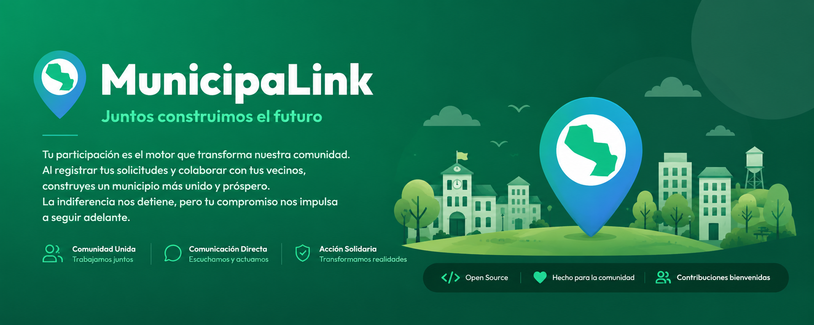

<div align="center">
  
</div>

# 🏛️ MunicipaLink

**Plataforma de Participación Ciudadana para la Transparencia Municipal**

MunicipaLink es una aplicación web que empodera a los ciudadanos para reportar incidencias urbanas (baches, luminarias rotas, basura, etc.), realizar seguimientos en tiempo real y fomentar la transparencia gubernamental a través de un sistema de gamificación que recompensa la participación activa.

🚀 **Quieres probarlo:** [https://municipalink.vercel.app/](https://municipalink.vercel.app/)

---

## ✨ Características Principales

### 🗺️ Reportes Georreferenciados
- **Mapa Interactivo**: Visualiza y crea reportes directamente en el mapa usando Leaflet.js y OpenStreetMap
- **Geolocalización Automática**: Detecta tu ubicación y la municipalidad más cercana
- **Evidencias Fotográficas**: Adjunta imágenes comprimidas automáticamente para optimizar el almacenamiento
- **Categorización**: Clasifica incidencias por tipo (infraestructura, servicios, seguridad, etc.)

### 🎮 Gamificación y Engagement
- **Sistema de XP**: Gana puntos de experiencia por reportar, comentar y votar
- **Niveles y Rangos**: Progresa desde "Vecino Observador" hasta "Líder Comunitario"
- **Trust Meter**: Indicador de confiabilidad basado en la completitud del perfil (1.0x - 2.0x multiplicador)
- **Insignias**: Desbloquea logros por hitos de participación

### 👥 Interacción Social
- **Sistema de Votos**: Apoya o rechaza reportes para medir su relevancia
- **Comentarios**: Discute y colabora en la resolución de incidencias
- **Seguimiento de Reportes**: Recibe notificaciones sobre reportes que te interesan
- **Perfiles Públicos**: Visualiza la reputación y contribuciones de otros ciudadanos

### 🛠️ Gestión Municipal Pro (Nuevo)
- **Panel Municipal**: Vista dedicada para funcionarios con filtrado avanzado por prioridad y estado.
- **Soporte Multi-departamento**: Asigna múltiples áreas a un mismo reporte. Buscador integrado para gestión rápida.
- **Navegación GPS**: Botón "Ir al lugar" que vincula directamente con Google Maps Navigation.
- **Resolución con Evidencia**: Cierre obligatorio de reportes adjuntando fotos de la solución o motivo de rechazo.
- **Línea de Tiempo**: Visualización de hitos (creado, asignado, resuelto) con cálculo de tiempos para ciudadanos.

### 🏆 Ranking Municipal (Nuevo)
- **Ranking de Municipalidades**: Clasificación en tiempo real basada en tasa de resolución de reportes y calificaciones ciudadanas.
- **Perfiles Públicos de Municipalidades**: Cada municipalidad tiene un perfil con estadísticas, sistema de calificación (1-5★) y comentarios abiertos.
- **Sistema de Badges**: Clasificación por niveles de desempeño (Élite, Destacada, En Crecimiento, Atención Requerida).

### 📊 Transparencia y Administración
- **Panel Admin Central**: Control de usuarios (baneo, edición), municipalidades y solicitudes de rol.
- **Ranking de Impacto**: Priorización automática basada en algoritmos de relevancia comunitaria.
- **Infinite Scroll**: Carga progresiva de reportes para mejorar el rendimiento.
- **Seguridad Robusta**: Protección contra XSS y validación de roles en UI y BD.
- **Filtros Avanzados**: Por estado, categoría, fecha y municipalidad
- **Estadísticas Personales**: Visualiza tu impacto en la comunidad
- **Privacidad Configurable**: Controla qué información de tu perfil es pública

---

## 🛠️ Stack Tecnológico

### Frontend
- **HTML5 + CSS3**: Interfaz moderna con diseño premium y glassmorphism
- **JavaScript (ES6 Modules)**: Arquitectura modular sin frameworks pesados
- **Leaflet.js**: Mapas interactivos con OpenStreetMap (Carga Diferida)
- **Lucide Icons**: Sistema de iconografía consistente

### Backend y Servicios
- **Supabase**: Backend-as-a-Service con PostgreSQL + PostGIS
- **Autenticación**: Sistema de usuarios con roles (admin, user, guest)
- **Storage**: Almacenamiento de evidencias fotográficas
- **RPC Functions**: Lógica de negocio en el servidor (cálculo de XP, gamificación)

### Herramientas
- **Compresión de Imágenes**: Optimización automática al 70% de calidad
- **Logger Personalizado**: Sistema de trazabilidad con niveles (info, warn, error)
- **TableRenderer**: Utilidad centralizada para tablas de administración.

---

## 📁 Arquitectura del Proyecto

```
MunicipaLink/
├── index.html              # Punto de entrada (Single Page App)
├── main.js                 # Inicialización y orquestación
├── styles/                 # Sistema de diseño CSS (Metodología BEM)
├── sql/                    # Scripts de base de datos (vistas, funciones)
├── src/                    # Lógica de negocio modularizada
│   ├── components/         # Templates UI (ReportCard)
│   ├── modules/            # Controladores (auth, map, reports...)
│   ├── services/           # Acceso a datos (ReportsService)
│   └── utils/              # helpers, logger, ui (toasts, modal)
├── tests/                  # Pruebas unitarias y de integración
├── AI_CONTEXT.md           # Contexto para agentes de IA
└── TECHNICAL_REFERENCE.md  # Catálogo técnico y estándares
```

---

## 🚀 Instalación y Configuración

### Prerrequisitos
- Navegador moderno (Chrome, Firefox, Edge, Safari)
- Cuenta de Supabase (gratuita)
- Servidor web local (opcional: Live Server, http-server, etc.)

### Configuración Rápida

1. **Clonar el repositorio**
   ```bash
   git clone https://github.com/ThianR/MunicipaLink.git
   cd MunicipalLink
   ```

2. **Configurar variables de entorno**
   ```bash
   cp .env.example .env
   ```
   
   Edita `.env` con tus credenciales de Supabase:
   ```env
   VITE_SUPABASE_URL=https://tu-proyecto.supabase.co
   VITE_SUPABASE_ANON_KEY=tu-clave-anonima
   ```

3. **Configurar la base de datos**
   - Accedé al SQL Editor del panel de Supabase
   - Ejecutá los archivos `sql/` en orden correlativo: `00_config.sql` hasta `11_gamificacion_municipal.sql`
   - Todos los scripts son idempotentes (seguros de re-ejecutar)

4. **Iniciar el servidor local**
   ```bash
   npm install
   npm run dev
   ```

5. **Acceder a la aplicación**
   ```
   http://localhost:3000
   ```

---

## 📖 Uso

### Para Ciudadanos
1. **Regístrate** con tu email o ingresa como **Invitado** (solo lectura)
2. **Completa tu perfil** para aumentar tu Trust Meter (multiplicador de XP)
3. **Reporta incidencias** desde el mapa o la vista de reportes
4. **Interactúa** votando, comentando y siguiendo reportes relevantes
5. **Sube de nivel** y desbloquea insignias por tu participación

### Para Funcionarios Municipales
1. **Accede al Panel Municipal** via "Mi Municipalidad" en el sidebar.
2. **Gestiona Reportes**: Asigna departamentos, cambia prioridades y añade observaciones.
3. **Navega al Sitio**: Usa el botón "Ir al lugar" para llegar al punto exacto de la incidencia.
4. **Resuelve**: Sube evidencias fotográficas finales para cerrar el reporte.

### Para Administradores
- Gestión global de usuarios, baneos y aprobación de nuevos roles municipales.

---

## 🎨 Principios de Diseño

- **Premium First**: Diseño moderno con gradientes, glassmorphism y animaciones suaves
- **Mobile Responsive**: Optimizado para dispositivos móviles y tablets
- **Accesibilidad**: Contraste adecuado, navegación por teclado, semántica HTML5
- **Performance**: Compresión de imágenes, lazy loading, optimización de consultas

---

## 🤝 Contribuir

¡Las contribuciones son bienvenidas! Por favor:

1. Lee `AI_CONTEXT.md` y `TECHNICAL_REFERENCE.md` antes de empezar
2. Crea un fork del repositorio
3. Crea una rama para tu feature (`git checkout -b feature/nueva-funcionalidad`)
4. Mantén la modularidad: cada módulo tiene una responsabilidad clara
5. Usa el Logger para trazabilidad (`Logger.info`, `Logger.warn`, `Logger.error`)
6. Actualiza `TECHNICAL_REFERENCE.md` si modificas funciones existentes
7. Haz commit de tus cambios (`git commit -m 'Agrega nueva funcionalidad'`)
8. Push a la rama (`git push origin feature/nueva-funcionalidad`)
9. Abre un Pull Request

### Reglas de Oro
- **No duplicar código**: Consulta `TECHNICAL_REFERENCE.md` antes de crear funciones
- **Database First**: Las validaciones y cálculos complejos van en Supabase (vistas/RPC)
- **Eventos sobre callbacks**: Usa Custom Events para comunicación entre módulos
- **CSS Variables**: Respeta las variables de color definidas en `style.css`

---

## 📄 Licencia

Este proyecto está bajo la Licencia MIT. Consulta el archivo `LICENSE` para más detalles.


## 🌟 Roadmap

- [x] Panel de administración avanzado (Usuarios/Munis)
- [x] Flujo de solicitudes de rol municipal con feedback obligatorio
- [x] Gestión Municipal con Multi-departamento y Evidencias
- [x] Navegación GPS e Historial/Timeline visual
- [x] Mejoras de Seguridad (XSS) y Performance (Infinite Scroll)
- [x] Ranking Municipal con calificaciones y comentarios ciudadanos
- [x] Exportación de reportes a PDF/Excel
- [ ] Integración con redes sociales
- [ ] App móvil nativa (React Native / Flutter)
---

## 📞 Contacto y Soporte

- **Issues**: [GitHub Issues](https://github.com/ThianR/MunicipaLink/issues)
- **Documentación**: Ver `AI_CONTEXT.md` y `TECHNICAL_REFERENCE.md`
- **Email**: gabrielrolonth@gmail.com

---

<div align="center">
  <p>Hecho con ❤️ para mejorar nuestras comunidades</p>
  <p><strong>MunicipaLink</strong> - Conectando ciudadanos con sus municipalidades</p>
</div>
